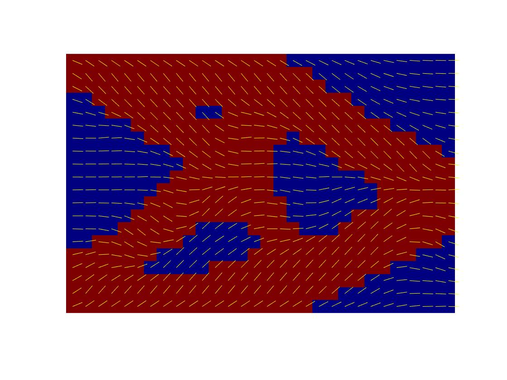
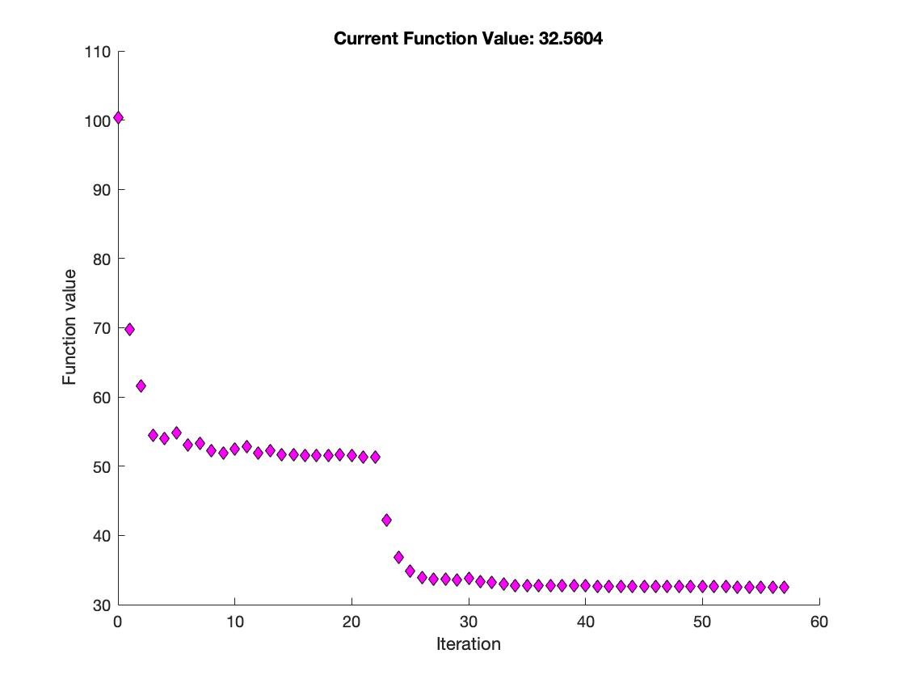
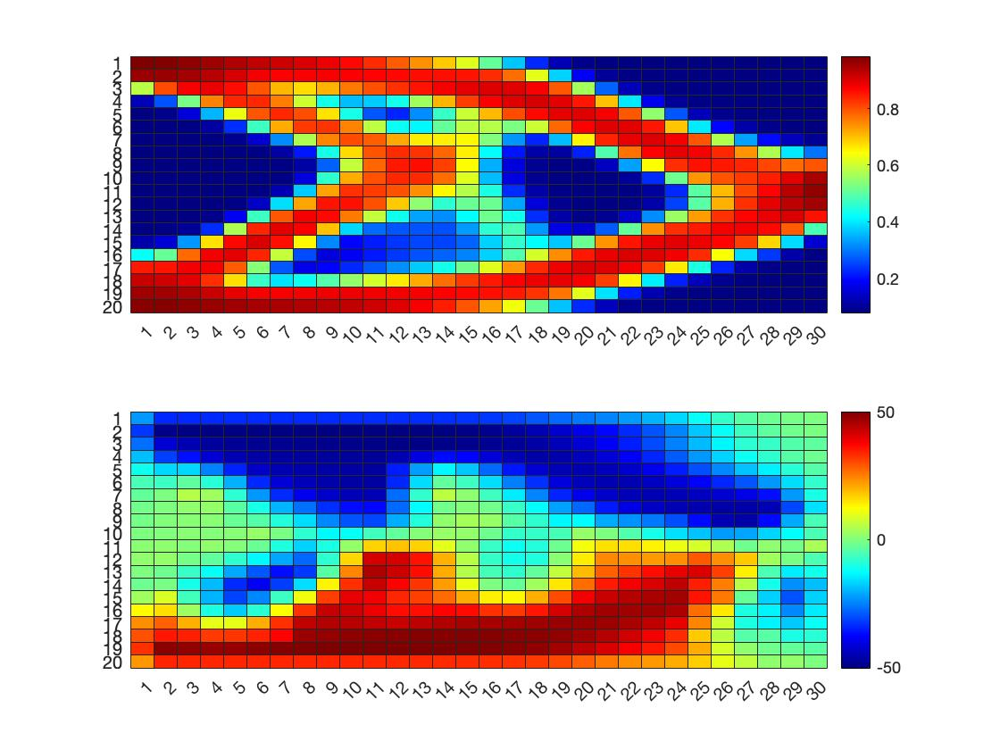

# SOMP
Solid Orthotropic Material with Penalisation

The code is based on top99: less efficient, restricted to 2D.
But More readable for beginners ;)

# Tutorial 

## main.m
main.m : main programm setup the constrained optimization problem and solve it with interior-point method (fmincon)

x0 is the initial design vector x0 = [rho0(:);theta0(:)];
global nelx nely vol volfrac ang angle  penal rmin % global variable

## check.m
function [dcn]=check(nelx,nely,rmin,x,dc) : top99 MESH-INDEPENDENCY FILTER

## top_obj.m
[c, dt]=top_obj(x) : output compliance c and dc/drho, dc/dtheta

## myConstrFcn.m
function [cneq, ceq, gradc, gradceq] = myConstrFcn(x) : output nonlinear constraints and derivative

## lk0d.m
function [KE,dKE]=lkOd(angle); CLT for 1-layer composite membrane fully integrated KE(8x8 matrix), and derivative with respect to angle dKE, called in FE.m
Orthotropic equivalent function to TOP99 lk.m
For a fixed material:
Ex=1;
Ey=5;
nuxy = 0.3;
nuyx = 0.3;

## lk0d_laminate.m
function [KE,dKE]=lkOd_laminate(angle); CLT for 1-layer composite membrane fully integrated Ke (8x8 matrix), and derivative with respect to angle, called in FE.m with fixed material: Ex=44.8e+03; % longitudinal Elastic modulus [MPa]
Ey=4.2e+03; % transversal Elastic modulus [MPa]
%Glt=1.9e+03; % Shear Modulus [MPa]
nuxy=0.49; % Poisson ratio
nuyx=nuxy*Ey/Ex;

## integK_laminate.m
Symbolic integration of Ke for a fixed material. Not used in Optimization

## FE.m
function [U]=FE(nelx,nely,vol,ang,penal); output displacement as a function of the actual iteration (and x vector)
similar to TOP99 FE.m

## myOutputFcn.m
needed for output of the objective function

## Postprocessing
Convolution filter to smooth fiber orientation

## TO GO FURTHER

use top88.m for vectorization/speed/memory [demo](http://htmlpreview.github.io/?https://github.com/jomorlier/ALMcourse/blob/master/top88/topopt_3ptBENDING.html)

use top88_fmincon.m to compare with this code

use top88_MMA.m with MMA (need svanberg's files mmasub, subsolv) to see the ability of MMA to tackle the XO sensitivity ?

use to88_heaviside_MMA.m for stress constrained and MMA [demo](http://htmlpreview.github.io/?https://github.com/jomorlier/ALMcourse/blob/master/AdvancedTopOpt/StressBasedTopOpt.html)

use top99neo.m with MMA for 3D problem [code](https://www.topopt.mek.dtu.dk/apps-and-software/new-99-line-topology-optimization-code-written-in-matlab)

## Bibliography

[Begineer's guide in FE with matlab and abaqus](https://mihanbana.com/dl/matlab-Abaqus-mihanbana.com.pdf)

Topology and printing orientation optimization of orthotropic material for additive manufacturing
https://yorkspace.library.yorku.ca/xmlui/handle/10315/38783

An Anisotropic Topology Optimization Method For Carbon Fiber-Reinforced Fused Filament Fabrication
https://baylor-ir.tdl.org/handle/2104/9821
 

Three dimensional topology optimization with orthotropic material orientation design for additive manufacturing structures.
https://baylor-ir.tdl.org/handle/2104/10163 

Jiang's journal paper
https://www.mdpi.com/2079-6439/7/2/14/htm

